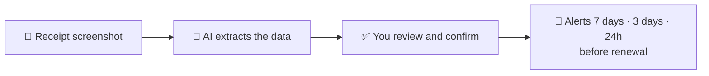

  

  <strong>Your subscriptions under control — no bank integration, no manual typing</strong> 
  <em>Upload a receipt screenshot, the AI fills the form, and you get warned before every renewal</em>

  <a href="/README.md" target="_blank">🇧🇷 Português</a>
  &nbsp;&nbsp;&nbsp;|&nbsp;&nbsp;&nbsp;
  <a href="/docs/spec.md" target="_blank">📄 Full specification</a>
  &nbsp;&nbsp;&nbsp;|&nbsp;&nbsp;&nbsp;
  <a href="https://github.com/PedroRigolon/under-ctrl/issues" target="_blank">🐛 Report Bug</a>

  
  
  

---

<!-- 🎬 DEMO: drag an .mp4 file here in the GitHub editor to generate the user-attachments link -->

  

**Under CTRL** is a freemium SaaS for managing recurring subscriptions. It works as an "invisible sentinel": you register your subscriptions once and the app warns you before every renewal — via email and/or Telegram.

> 💡 **The differentiator is onboarding:** you upload a receipt screenshot, the AI extracts the name, amount and date, and the form arrives pre-filled for you to review and confirm. No bank account linking.

## ⚡ How it works

## 📱 Screens

### Homepage

### Login

### Mobile-first

  
  &nbsp;&nbsp;&nbsp;
  

## 🛠️ Stack

  
  
  
  
   
  
  
  
  
   
  
  
  

## 🔒 Privacy & LGPD

- 🧠 The AI only **pre-fills** — every final decision is yours (*human-in-the-loop*).
- 🗑️ Receipt images are **never stored**: they live only in RAM during processing.
- 💳 Payment data is handled exclusively by Mercado Pago (PCI-DSS).
- 📤 Your data is yours: JSON export and account deletion via *hard delete*.

## 🚦 Project status

| Stage | Status |
| ----- | :----: |
| Concept & scope | ✅ |
| Branding (name, logo, colors, fonts) | ✅ |
| Figma Design System & wireframes | 🚧 |
| Frontend — homepage & login | ✅ |
| Frontend — logged-in area | 🚧 |
| Backend | ⏳ |

---

   
  <strong>Author:</strong> Pedro Rigolon · <strong>Group:</strong> RC Studio — Software Development

