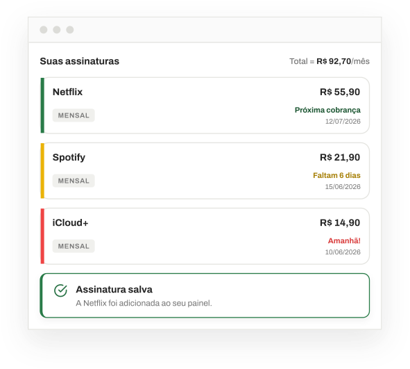
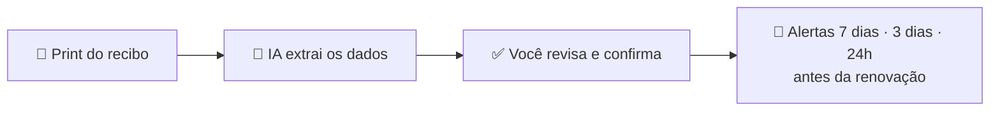
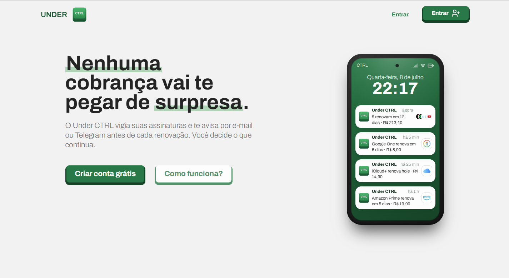
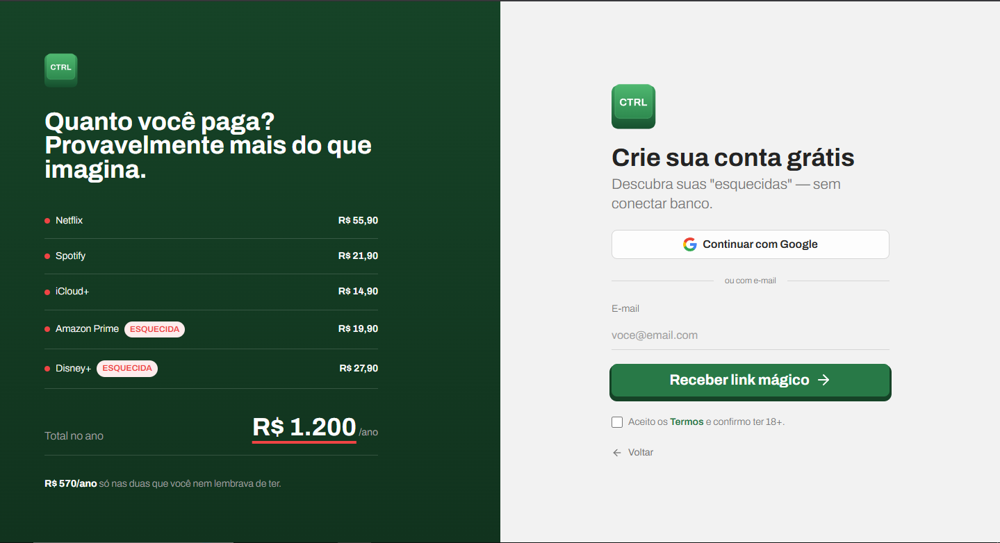
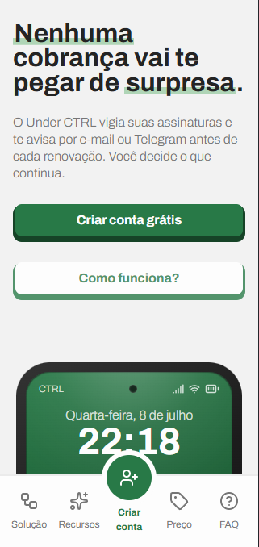
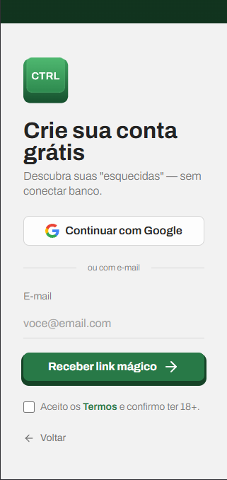

  

  <strong>Suas assinaturas sob controle — sem integração bancária, sem digitação manual</strong> 
  <em>Envie um print do recibo, a IA preenche o cadastro e você é avisado antes de cada renovação</em>

  <a href="/README-en.md" target="_blank">🇺🇸 English</a>
  &nbsp;&nbsp;&nbsp;|&nbsp;&nbsp;&nbsp;
  <a href="/docs/spec.md" target="_blank">📄 Especificação completa</a>
  &nbsp;&nbsp;&nbsp;|&nbsp;&nbsp;&nbsp;
  <a href="https://github.com/PedroRigolon/under-ctrl/issues" target="_blank">🐛 Reportar Bug</a>

  
  
  

---

<!-- 🎬 DEMO: arraste um vídeo .mp4 aqui pelo editor do GitHub para gerar o link user-attachments -->

  

**Under CTRL** é um SaaS freemium de gestão de assinaturas recorrentes. Ele atua como um "sentinela invisível": você cadastra suas assinaturas uma vez e o app avisa antes de cada renovação — por e-mail e/ou Telegram.

> 💡 **O diferencial está no cadastro:** você envia um print do recibo, a IA extrai nome, valor e data, e o formulário chega pronto para você só revisar e confirmar. Nada de conectar sua conta do banco.

## ⚡ Como funciona

## 📱 Telas

### Homepage

### Login

### Mobile-first

  
  &nbsp;&nbsp;&nbsp;
  

## 🛠️ Stack

  
  
  
  
   
  
  
  
  
   
  
  
  

## 🔒 Privacidade e LGPD

- 🧠 A IA apenas **pré-preenche** — toda decisão final é sua (*human-in-the-loop*).
- 🗑️ Imagens de recibo **nunca são armazenadas**: existem só na RAM durante o processamento.
- 💳 Dados de pagamento ficam exclusivamente no Mercado Pago (PCI-DSS).
- 📤 Seus dados são seus: exportação em JSON e exclusão de conta com *hard delete*.

## 🚦 Status do projeto

| Etapa | Status |
| ----- | :----: |
| Conceito e escopo | ✅ |
| Branding (nome, logo, cores, fontes) | ✅ |
| Design System e wireframes no Figma | 🚧 |
| Frontend — homepage e login | ✅ |
| Frontend — área logada | 🚧 |
| Backend | ⏳ |

---

   
  <strong>Autor:</strong> Pedro Rigolon · <strong>Grupo:</strong> RC Studio — Desenvolvimento de Software

